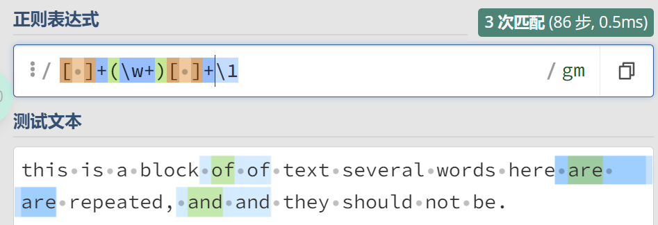

### 反向引用
#### 什么是反向引用
反向引用允许正则表达式引用之前匹配的结果。

```
例1：
问题描述：
Oh no! It seems my friends 
spilled beer all over my keyboard last night 
and my keys are super sticky now. 
Some of the time whennn I press a key, 
I get two duplicates. 
Can you ppplease help me fix thhhis?
正则表达式：
(.)\1\1
替换：
$1

例2：
假如你有一段文本，
你想把这段文本里所有连续重复出现的单词
（打字错误，同一个单词输了两遍）
找出来。
this is a block of of text several words 
here are are repeated, 
and and they should not be.
正则表达式
[ ]+(\w+)[ ]+\1
\s+(\w+)\s+\1
```
##### 例2结果


##### 例2结果分析
1. `[ ]+`匹配一个或多个空格。
2. `(\w+)`匹配一个或多个字母数字字符，并且将其标识出来，以备后用。
3. `\1`反向应用。

##### 一点小感悟
如果我想匹配aaa，那么正则表达式就是aaa。但是我想匹配bbb、ccc、ddd...呢。于是需要进一步抽象。
