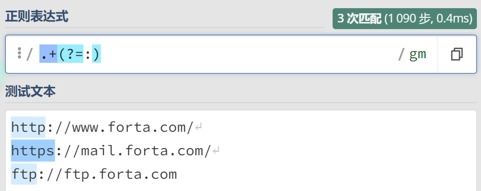
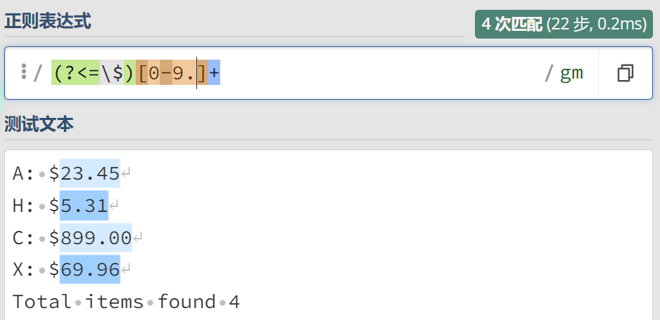
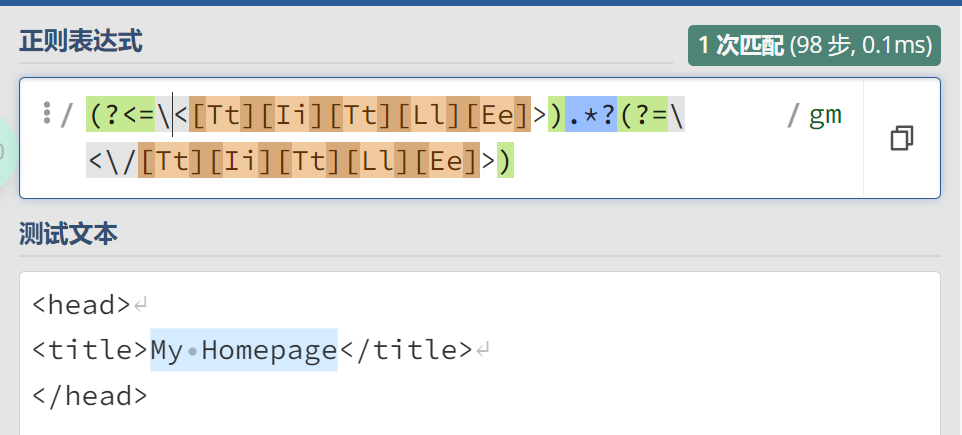

### 环视
#### 环视简介
1. 英文单词：lookaround，能够前后查看。
2. 在模式当中有些部分是为了找出正确的匹配位置，其自身不属于最终的匹配结果。换句话说，你需要进行环视。
##### 例子
```
<head>
<title>My Homepage</title>
</head>
正则表达式：
<[Tt][Ii][Tt][Ll][Ee]>.*?<\/[Tt][Ii][Tt][Ll][Ee]>
```
在这个正则表达式中
`<[Tt][Ii][Tt][Ll][Ee]>`和`<\/[Tt][Ii][Tt][Ll][Ee]>`部分是为了找到正确的匹配位置（工具人），最终的匹配是不带标签的文本。
部分
#### 向前查看
1. 向前环视指定了一个必须匹配但不用在结果中返回的模式。
2. 语法：`?=`开头的**子表达式**。
3. 术语：
    - 消耗：表述“匹配和返回文本”的含义。
向前查看不消耗所匹配的文本。

##### 例子：
匹配URL的协议部分。
```
http://www.forta.com/
https://mail.forta.com/
ftp://ftp.forta.com
正则表达式：
.+(?=:)
```
##### 结果

##### 分析
`?=`告诉正则表达式引擎：匹配`:`只是为了向前查看（不用消耗该字符）。
#### 向后查看
1. 向后查看与向前查看类似，只是充当工具人。
2. 语法：`(?<=)`。
##### 例子：
你从某个数据库中搜索出了一份产品清单，但是你只要产品价格。
```
A: $23.45
H: $5.31
C: $899.00
X: $69.96
Total items found 4
正则表达式
(?<=\$)[0-9.]+
```
##### 结果


#### 结合向前查看与向后查看
回到`环视简介`中的例子：
`<title>My Homepage</title>`。如果只想匹配`My Homepage`，则需要结合`向前查看`与`向后查看`。
正则表达式如下：
`(?<=\<[Tt][Ii][Tt][Ll][Ee]>).*?(?=\/\<[Tt][Ii][Tt][Ll][Ee]>)`;
**注意：**
1. 该转义的转义，如`<`，`\`...
2. 简化工作应该在完成任务之后进行。
##### 结果：

#### 否定环视
1. 否定式向前查看：
   - 会向前查看不匹配指定模式的文本。
2. 否定式向后查看：
   - 会向后查看不匹配指定模式的文本。

例子：
在既有价格又有数量的文本中。
```
I paid $30 for 100 apples,
50 oranges and 60 pears.
I saved $5 on this order.

先取出价格。
正则表达式：
/(?<=\$)\d+/gm;（向后环视）
再取出数量。
正则表达式：
/\b(?<!\$)\d+\b/gm （否定向后环视）
结果：
!
```
#### 小节
1. **环视可以更精细的控制最终的返回结果。**
2. 环视操作允许利用子表达式来指定文本匹配操作发生的位置，但同时又不会消耗匹配到的文本（不出现在最终的匹配结果里）。（指定匹配发生的位置，不消耗匹配到的文本。）
