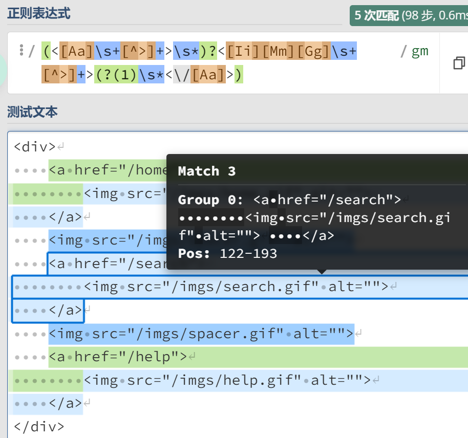

### 嵌入式条件
#### 反向引用条件
1. 语法：(?(backreference)true)
例子：
```
<div>
    <a href="/home">
        
    </a>
    
    <a href="/search">
        
    </a>
    
    <a href="/help">
        
    </a>
</div>
分析：有的图片有a标签包裹，有的则没有。
正则表达式：
/(<[Aa]\s+[^>]+>\s*)?<[Ii][Mm][Gg]\s+[^>]+>(?(1)\s*<\/[Aa]>)/gm
```
结果：

注意：a标签前后可能有若干个空格，`(<[Aa]\s+[^>]+>\s*)`中`\s*`不能少。

##### 分支语法：
(?(backreference)true|false)
例子：
```
123-456-7890
(123)456-7890
(123)-456-7890
(123-456-7890
1234567890
123 456 7890
正则表达式：
(\()?\d{3}(?(1)\)|-)\d{3}-\d{4}
匹配的结果和书上的有出入。
```
#### 环视条件
例子：
```
11111
22222
33333
44444-
44444-4444

正则表达式：
\d{5}(?(?=-)-\d{4})
`(?=-)`用来判断`-`是否存在。
```